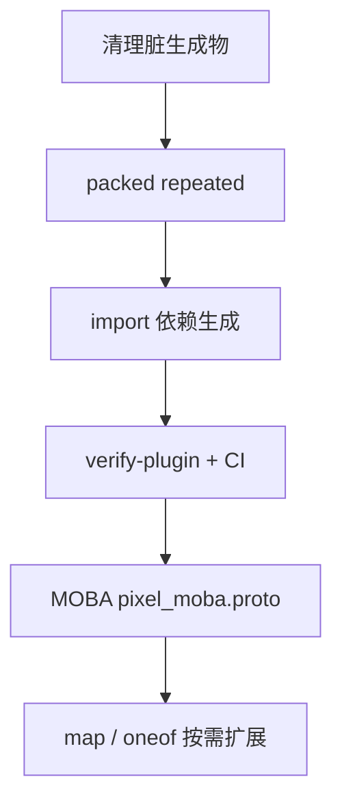

# Proto → Godot 工具链缺口分析

> 更新基准：message 生成已支持 repeated / 嵌套 message / enum / float·fixed·sint（protoc descriptor + WireCodec emit）。  
> 本文档描述**仍缺失或未对齐**的部分，供 MOBA 协议扩展与 CI 守门参考。  
> 相关文档：`proto_codegen.md`（能力与入口）、`route_comment_spec.md`（route 约定）。

---

## 1. 当前已具备的能力

| 环节 | 脚本 / 产物 | 说明 |
|------|-------------|------|
| Route 生成 | `gen_routes_from_proto.py` → `*_routes.gd` | 解析 `// route:`；支持 `--verify-plugin` |
| Message 生成 | `gen_messages_from_proto.py` → `{message_snake}.gd` | protoc descriptor + 自研 WireCodec emit |
| Platform | `gen_proto_godot.ps1` / `.sh` + `proto_manifest.json` | auth / envelope |
| Demo consumer | `sync_demo_generated.ps1` + `sdk/godot/demo/register_protocol.txt` | 扁平输出 `demo/generated/` |
| pixel-moba | `sync_infra.ps1` + `infra/tools/register_protocol.txt` | `infra/generated/protocol/{leaf}/` |
| 一键同步 | `sync_godot_generated.ps1` | platform + demo |

**Message 类型支持（emit 层）：**

- scalar：string、bytes、bool、int32/64、uint32/64、sint32/64（zigzag）、float/double、fixed32/64、sfixed32/64
- `repeated`（scalar / enum / message）
- 嵌套 message → 扁平类名 `Beast{Parent}{Child}`（如 `Player.Position` → `BeastPlayerPosition`）
- enum → 独立 `{enum_snake}.gd` const 类，字段类型 `int`

**Runtime：** `beast_sdk/impl/codec/wire_codec.gd`

---

## 2. 缺口总览（按优先级）

| 优先级 | 缺口 | 影响 |
|--------|------|------|
| **P0** | 跨文件 `import` | MOBA 共享类型无法自动拉齐依赖 |
| ~~**P0**~~ | ~~`packed repeated`~~ | ✅ 已实现（proto3 默认 packed + decode 兼容 unpacked） |
| **P0** | `map` / `oneof` | 常见游戏协议结构无法生成 |
| ~~**P0**~~ | ~~脏生成物 / stub~~ | ✅ 已清理 ping/room 遗留 |
| **P0** | 空 `pixel_moba.proto` | sync 噪音、占位未完成 |
| **P1** | `--verify-plugin` 未接入 sync/CI | proto 与服务端注册易漂移 |
| **P1** | 无 stale 文件清理 | 重命名 message 后旧 `.gd` 残留 |
| **P1** | 测试 / CI 薄弱 | 无字节级跨端对照、无 route 单测 |
| **P1** | gRPC Room 无正式策略 | manifest 标注 grpc_only，仓库仍有 stub |
| **P1** | Linux sync 不完整 | 仅有 `gen_proto_godot.sh`，无 demo sync shell |
| **P2** | default / optional 语义 | 与官方 protobuf 有差距 |
| **P2** | repeated enum 跳过 0 | 合法 enum 0 可能被省略 |
| **P2** | enum/message 文件名冲突 | 扁平 stem 可能撞名 |
| **P2** | manifest `messages` 未过滤 | 声明与实际生成不一致 |
| **P2** | Native vs Godot 双轨 codec | 长期可能字节漂移 |
| **P2** | demo 扁平 vs moba 分目录 | 多 proto 注册时 demo 易文件名冲突 |
| **P3** | BOM / robocopy 退出码 / 文档 | 开发体验 |

---

## 3. P0 — MOBA 协议落地前建议先补

### 3.1 跨文件 `import` 未覆盖

**现状：**

- `gen_messages_from_proto.py` 按**单个** `--proto` 文件生成，只 emit 该文件内定义的 message/enum。
- 当前 `bizconfig/protocol` 下**无任何 `import`** 语句。

**问题场景：**

```protobuf
// game/moba/pixel_moba/move.proto
import "game/moba/common/types.proto";

message MoveCmd {
  common.Vec2 dir = 1;
}
```

生成 `MoveCmd` 时字段引用 `BeastVec2`，但 **`vec2.gd` 不会自动生成**，除非单独对 `types.proto` 再跑一遍，且需保证输出目录与类名不冲突。

**建议：**

- register 目录级扫描，构建 proto 依赖图，按拓扑顺序生成；或
- 单次 invocation 解析 descriptor set 内全部相关 file，合并 emit。

---

### 3.2 ~~`packed repeated` 未实现~~ ✅ 已支持

**现状（2025-06）：**

- proto3 数值型 / enum 的 `repeated` 默认 **packed** encode（`WireCodec.encode_packed_*`）
- decode 同时兼容 **packed**（LENGTH_DELIMITED）与 **unpacked**（逐条 field）
- `repeated string/bytes/message` 仍为非 packed

---

### 3.3 `map` / `oneof` 未支持

**现状：** `proto_codegen.md` 已声明未支持；遇到即 `ValueError` 或无法 emit。

**MOBA 典型用途：**

- `map<string, int32>` — 玩家属性、buff 表
- `oneof` — 多种 packet  payload 互斥分支

**建议：** 扩展 WireCodec（map → repeated entry message；oneof → GDScript 变体字段 + match decode）后再开 MOBA 复杂 proto。

---

### 3.4 ~~脏生成物与 stub~~ ✅ 已清理

已从 `sdk/godot/beast_sdk/generated/` 移除：

- `ping_request2.gd` / `ping_push2.gd`（业务 demo，应只在 `demo/generated/`、`infra/generated/protocol/demo_event/`）
- `room_request.gd` / `room_response.gd`（手写 M3 stub；Room 走 gRPC，不进 beast_sdk）

`sync_infra.ps1 -SyncSdk` 同步时会主动删除 addon 内上述残留。

---

### 3.5 空 `pixel_moba.proto`

**现状：**

- `pixel-moba/infra/tools/register_protocol.txt` 已注册 `moba/pixel_moba`。
- `pixel_moba.proto` 为空 → sync 打印 `SKIP: no messages`，无实际产物。

**建议：** MOBA 起草协议前可暂时从 register 移除，或写入最小 placeholder message，避免 sync 噪音。

---

## 4. P1 — 工程化与质量门禁

### 4.1 `--verify-plugin` 未接入

**已有能力：**

```bash
python sdk/tools/gen_routes_from_proto.py \
  --proto bizconfig/protocol/game/example/demo_event/demo_event.proto \
  --verify-plugin beastserver/plugins/game/example/demo_event/plugin.cpp
```

**缺失：**

- `sync_demo_generated.ps1`、`sync_infra.ps1` **未调用** verify。
- 无 CI job 在 proto 变更时核对 plugin 注册。

**注意：** platform `auth.proto` 非 game plugin 注册模型，**不能**强行用 verify-plugin；仅适用于 game plugin consumer（如 demo_event）。

---

### 4.2 无 stale 生成物清理

**现状：** 生成器只 write，不 delete。message 重命名或删除后，旧 `{snake}.gd` 仍留在 `generated/`。

**风险：** Godot `class_name` 冲突、引用已删除类型。

**建议：** sync 脚本可选 `--clean`：对比 proto descriptor 与目录内 `*.gd`，删除多余文件（保留 `*_routes.gd` 规则一致）。

---

### 4.3 测试覆盖

| 层级 | 已有 | 缺失 |
|------|------|------|
| Python | `test_gen_messages_from_proto.py`（5 用例） | `gen_routes_from_proto.py` 单测 |
| Python | emit 形状断言 | **字节级 roundtrip**（vs `google.protobuf` 或 C++） |
| Godot | `wire_codec_test.gd`、auth/envelope/ping | repeated/nested/enum **生成类** roundtrip |
| CI | 无 | `pip install` + `protoc` + 生成 + `unittest` + 可选 Godot headless |

**推荐最小 CI：**

```bash
pip install -r sdk/tools/requirements.txt
python sdk/tools/test_gen_messages_from_proto.py
./sdk/tools/gen_proto_godot.sh
python sdk/tools/gen_routes_from_proto.py \
  --proto bizconfig/protocol/game/example/demo_event/demo_event.proto \
  --verify-plugin beastserver/plugins/game/example/demo_event/plugin.cpp
```

---

### 4.4 gRPC Room message 策略

**现状：**

- 建房走 **gRPC**（`:9010`），非游戏客户端 TCP API（见 `sdk/core/spec/routes.md`）。
- manifest 仅文档性列出 `grpc_only_messages`，**无生成脚本**。
- 仓库仍留 `room_*.gd` stub，易误导为「客户端应 encode CreateRoomRequest」。

**建议决策（二选一）：**

1. **不生成**：删除 stub，文档说明仅用 grpcurl；或  
2. **工具链外生成**：独立目录 + `protoc-gen-go` 等，不进入 beast_sdk。

---

### 4.5 Linux 脚本

| 脚本 | Windows | Linux |
|------|---------|-------|
| Platform 生成 | `gen_proto_godot.ps1` | `gen_proto_godot.sh` ✅ |
| Demo 生成 | `sync_demo_generated.ps1` | ❌ 无 `.sh` |
| 一键 | `sync_godot_generated.ps1` | ❌ |

Linux VM / CI 上 demo 生成需手调 Python 或补 shell 包装。

---

## 5. P2 — 语义与一致性

### 5.1 proto `default` / `optional`

- 生成器**不读取** field default option；GDScript 仅用零值默认。
- proto3 `optional` 无 `has_*` / `clear_*`，无法区分「未设置」与「显式零值」。

多数游戏协议可接受；若 MOBA 需要严格 presence，需扩展 emit API。

---

### 5.2 repeated enum encode 跳过 0

当前 emit 对 repeated enum：

```gdscript
if item != 0:
    out.append_array(_WireCodec.encode_enum_field(...))
```

若 `0` 为合法 enum 值且需在 repeated 中保留，会被省略。需与协议设计对齐或改为始终 encode。

---

### 5.3 enum / message 文件名冲突

扁平规则：`message_to_snake("PlayerStatus")` → `player_status.gd`。

若同一 scope 内既有 enum `PlayerStatus` 又有 message `PlayerStatus`，会**覆盖同一文件**。

**建议：** enum 输出改为 `player_status_enum.gd` 或加前缀。

---

### 5.4 `proto_manifest.json` 的 `messages` 数组

manifest 示例：

```json
{ "proto": "platform/auth.proto", "messages": ["AuthRequest", "AuthResponse"] }
```

实际生成：**整个 proto 文件内全部 top-level + nested message**，`messages` 字段**未参与过滤**。

扩展 platform proto 时可能造成「manifest 声明」与「磁盘产物」不一致。

---

### 5.5 Native vs Godot 双轨 codec

| 路径 | 实现 |
|------|------|
| Godot | 生成 `{message}.gd` + `wire_codec.gd` |
| Native | `sdk/native` 手写 struct + `wire_codec.hpp` |

**无自动化**保证同一 proto 在 GDScript 与 C++ 产出相同 bytes。Native 侧有 `message_codec_test.cpp`，但与 Python 生成物未联动。

---

### 5.6 输出目录策略不一致

| Consumer | 输出布局 | 多 proto 风险 |
|----------|----------|---------------|
| demo | `sdk/godot/demo/generated/` **扁平** | 同 register 多子目录时易文件名冲突 |
| pixel-moba | `infra/generated/protocol/{leaf}/` **分目录** | 按 leaf 隔离 |

长期建议 demo 也改为 `{leaf}/` 子目录，或 register 一行对应一个输出子目录。

---

## 6. P3 — 文档与开发体验

| 项 | 说明 |
|----|------|
| UTF-8 BOM | PowerShell 写 proto 若带 BOM，protoc 报错；宜写入 `proto_codegen.md` 注意事项 |
| `sync_infra.ps1 -All` | robocopy 成功时 exit code 可能 > 0，脚本未 normalize，易误判失败 |
| Route 入口 | 平台 `BeastRoutes` 仅桥接 auth；业务 route 在各 consumer `*Routes.gd`，新人易找错 |

---

## 7. 建议落地顺序

```
1. ~~清理 beast_sdk/generated 脏文件~~ ✅
2. ~~packed repeated~~ ✅
3. import 多文件 / register 目录级联合生成
4. verify-plugin 接入 sync_demo + CI（demo_event）
5. stale 清理 + Python/Godot roundtrip 测试
6. MOBA proto 起草 → 按需 map / oneof
7. 补 Linux sync shell、BOM 文档
```



---

## 8. 结论

- **主链路不缺**：protoc 解析 → routes/message 生成 → register 驱动 sync，已支撑 demo/auth 联调。
- **规模化 MOBA 前**最优先：**packed repeated**、**跨 proto import**、**脏文件治理**。
- **长期维护**依赖：**verify-plugin CI**、**字节级 roundtrip**、**stale 清理**。

完成 P0 + P1 后，可安全在 `bizconfig/protocol/game/moba/pixel_moba/` 起草首版协议并注册到 `register_protocol.txt`。

---

## 9. 相关路径速查

```
bizconfig/protocol/
  platform/          ← manifest → beast_sdk/generated/
  game/              ← register_protocol.txt → demo/ 或 pixel-moba/infra/generated/protocol/

sdk/tools/
  gen_routes_from_proto.py
  gen_messages_from_proto.py
  gen_proto_godot.ps1 | .sh
  sync_demo_generated.ps1
  sync_godot_generated.ps1
  proto_manifest.json
  proto_codegen.md          ← 能力与入口
  proto_toolchain_gaps.md   ← 本文档
  route_comment_spec.md

pixel-moba/infra/tools/
  register_protocol.txt
  register_biz.txt
  sync_infra.ps1
```
